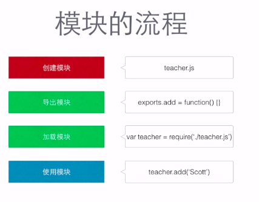
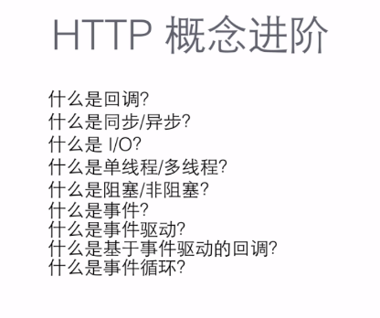
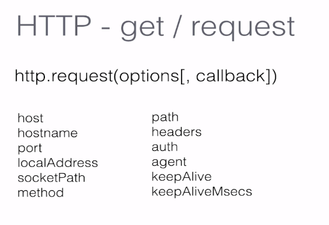

课程地址：[进击 Node.js 基础（一）](https://www.imooc.com/learn/348)

> 常刷网址：node 官网 Nodejs.org；伸手党的天堂：npmjs.org，stackoverflow.com

## Nodejs 基础知识

Node 本质上是一个 js 的执行环境

Js 天生缺乏模块管理机制来隔离不同区域使用的 js 代码

Nodejs 有规范，不用担心空间的污染,node 没有全局命名空间的概念

### 跑起来一个服务器

node-imooc/beginning/server.js

### URL 和 URI

- URL 统一资源定位

- URI 统一资源标识

- URL 是 URI 的子集

### 模块发布流程 school 文件夹下面的几个 js 案例



简称函数是怎么导出来的

```
exports.add = add;
// exports成为传统的模块实例，是module.exports的浮动方法

module.exports = add;
// 成为一个特别的对象类型， 是真实存在的东西
```

### url 方法

- `url.parse` 路径解析
  非常重要，解析互联网中的资源，解析合法的地址成对象
- `url.parse(urlString[, parseQueryString[, slashesDenoteHost]])`
  后面可以加两个 Boolean 值

- `url.format`
  把 `url.parse`解析的对象变成地址

- `url.resolve`
  模仿路径进行组合
- `querystring.stringify({name:'cmj', course:'node'})` 连接字符串
  可以加两个参数定义连接符和 key 和 value 之间的定义符
- `querystring.parse`
  反序列化
- `querystring.escape('哈哈')`
  转义
- `querystring.unescape`
  反转义

## HTTP 协议

计算机得遵守协议才能相互通信

HTTP 请求的方法：

- GET
- POST
- PUT
- DELETE
- HEAD
- TRACE
- OPTIONS

状态码：
响应类型，第一位数字： 1~5

## HTTP 概念：


<!--  -->

1. 什么是回调？通过回调进行异步编程，可以达到非阻塞的效果
   回调是异步编程时的基础，将后续逻辑封装成起始函数的参数，逐层嵌套
2. 什么是同步/异步？见 HTTP>ssync.js
   同步是指：发送方发出数据后，
   等接收方发回响应以后才发下一个数据包的通讯方式。按顺序执行  
   异步是指：发送方发出数据后，
   不等接收方发回响应，接着发送下个数据包的通讯。程序的执行顺序和任务的排列顺序不一致
3. I/O
   数据的读取和输出
4. 事件？事件驱动？HTTP>event.js
   回调函数什么时候被调用？
5. 基于事件驱动的回调
   注册事件的回调叫基于事件驱动的回调
   如果这些回调和异步操作的 I/O 有关，叫做基于事件回调的异步 I/O
6. 事件循环
   回调函数的队列，nodejs 通过单线程查询队列中是否有事件
   读取到事件的时候将调用与这个事件有关的 JS 函数，
   回调通过被加入的顺序进行执行
   整个队列可以理解为普通的函数和回调函数组成的完整的队列

## 作用域 HTTP>scope.js

函数访问变量的能力

## 上下文 HTTP>context.js

- 上下文表示 this 对应的值以及它的指向
  决定一个函数怎么被调用，当函数被调用的时候，
- this 总是指向调用这个方法的对象
  this 指向的是当前函数的拥有者，
- 如果当前函数前面没有拥有者，this 指的是 global， 在 HTTP>context.js 的第二个例子
  当前函数生成的对象，只能在函数内部使用
- 上下文执行对象需要依据当前的执行环境定 HTTP>call_aplly.js，因为可以改变执行环境
  用 call aplly 改变执行上下文的指向，实现继承 HTTP>call_aplly_extend.js

## HTTP 源码解读(其实是没听懂的)

代码地址：HTTP>http.js

- 在 GitHub 里面搜 node 的源码，直接看 lib>http.js
- 就可以知道 createServer 做了什么，
- 其实就是创建了一个 server 的实例，然后把参数 rs, req 传下去了

## HTTP 性能测试 HTTP>http.js

Apache ab

- HTTP>http.js, 服务端输入 node http 跑起来
- 然后新开一个命令行
  `ab -n1000 -c10 http://localhost:2018/`
- 注意地址后面要加上斜线
- 跑完测试，也就是进行压力测试搞清楚网页跑的慢的原因

## HTTP 爬虫 HTTP>imooc-crawler.js

仅仅是爬去页面内容

## HTTP 信息过滤爬虫 HTTP>crawler.js

`npm install cheerio`
用插件 cheerio（非常类似 jQuery）操作 HTML 的 dom

### 传参问题

引用 cheerio 的时候，当参数只有 item 的时候可以使用$(this)，
如果传入两个参数(index, item)，必须得使用$(item)才能给顺利取到单项值？

```
videos.each(function(index, item) {
var video = $(item).find('.J-media-item');
```

```
videos.each(function(item) {
var video = $(this).find('.J-media-item');
```

### 空格去除问题？

`var videoTitle = video.text().trim();`
请问为什么这一句代码，不能成功去除 videoTitle 的空格？

一定要下面的才可以呢？

```
var videoTitle = video.text();
videoTitle = trim(videoTitle);
```

## 事件模块有关函数的使用 res.on

详情见代码路径：node1-imooc/events/events.js

- addEventlistner 最多不能超过 10 个 on 事件，太多可能导致内存极限
- `life.setMaxListeners(11);`，设置最多监听事件，监听事件是为 emit 的事件设定的 on 函数

## HTTP - get/request 实现评论的提交

代码地址：node1-imooc/HTTP/comment.js
需要模拟一些数据，就没有具体写

